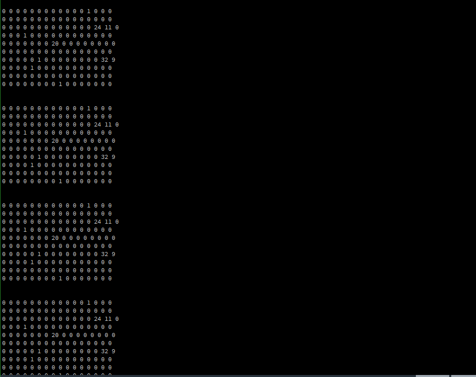

# klib2-processing

Simple example of Processing API for Snowforce 3.

※The provided code is example code, and the performance may differ from actual results.

DEVELOPMENT ENVIRONMENT
-----------------------
* Processing http://www.processing.org
* Snowforce 3
   * https://github.com/kitronyx/snowforce3/blob/master/Snowforce3.0_2022.02.17.exe
   
QUICK START
-----------
* Download or clone source code
* Open and run `klib_processing.pde`.
